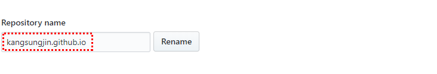
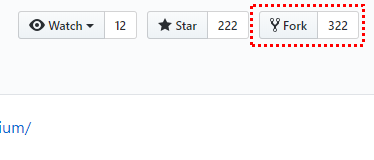
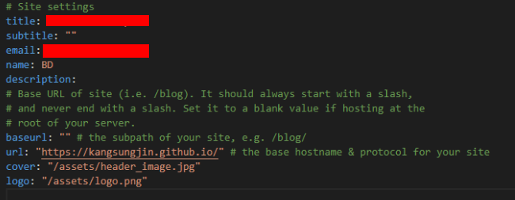
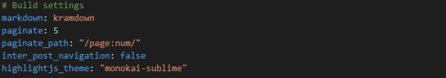
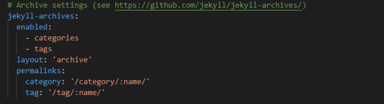
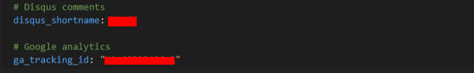
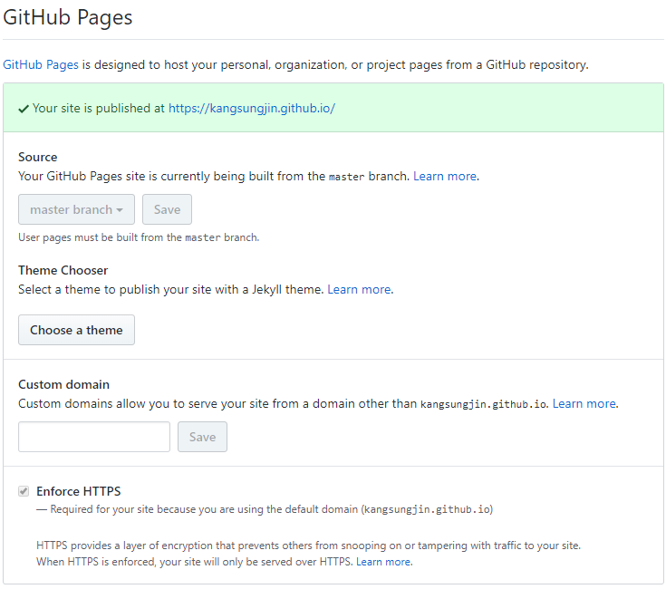

소개

깃 블로그를 관리하면서 마크다운 사용법 과 깃 커맨드 숙달하기 위함으로 이 페이지를 작성합니다. 

## 고려사항
- 깔끔한 스타일
- 댓글 기능 
- 반응형

블로그를 만들때 위 3개를 제일 많이 고려했다. 깔끔하면서 내가 작성한 정보에 대해서 상호작용을 할수 있는 댓글 기능까지 
여러 테마를 고려하였고, Hexo, jekyll 세팅테스트를 거쳐 드디어 jekyll로 하기 정했다. 
지킬 테마중에 [Centrarium](https://github.com/bencentra/centrarium)를 선택하였고, 링크를 통해 가보면 디테일한 사용방법에 대해
알아 볼수 있다. 

나 같은 경우는 바로 알아볼수 없었다. 티스토리에서 꽤 오래 블로그를 관리 하다가 깃블로그를 
처음 셋팅할때는 많이도 헤맨것 같다. 아직까지 헤매고 있는 부분은 jekyll을 로컬에 셋팅해서 
작업 하는 부분이다. 시간이 된다면 로컬에서 커스텀 하는 부분까지 해보고 싶을뿐이다..

### 1. 새 저장소 만들기

   

위 사진과 동일하게 자신의 블로그 네임을 레파지토리에 네임으로 적고 그뒤에 github.io를 같이 넣어 줍니다. 

kangsungjin.github.io로 쓰고 완료 합니다. 

### 2. Jekyll 테마 선택하여 fork하기

   

1. [Jekyll](http://jekyllthemes.org/)에 들어가 마음에 드는 테마를 클릭하여 들어갑니다. 
2. Homepage를 클릭하고 들어가면, 해당 Github 레파지토리가 나옵니다. 
3. 그럼 위 사진대로 fork 버튼을 클릭하면 바로 나의 레파지토리에 복사되서 들어옵니다. 

### 3. _config.yml 설정하기

   

__제목__{: style="color: #e26716"}

Title은 블로그의 제목이 되고, SubTitle은 그야 말로 서브적으로 사용하는 제목입니다. 
현재는 전체 관리에 미비하고, 포스팅만 하다보니 subtitle를 사용해 보고 있지만, Title과 
Despcription만 작성해도 좋을것 같습니다. 

__baseurl__{: style="color: #e26716"}

baseurl은 "" 으로 설정합니다. 이 칸에 "/blog/" 또는 "life"을 적을경우 
kangsungjin.github.io/{life}/{tags}  
kangsungjin.github.io/{blog}/{tags}  
위와 같이 적용됩니다. 

   

__마크다운__{: style="color: #e26716"}

마크다운도 여러 종류가 있기때문에, Kramdown을 확인후 작성해야 합니다. 공통된 문법은 비슷하다 
미묘하게 다르기때문에 고려해야 하는 부분입니다. 

   

__포스팅 기본체계__{: style="color: #e26716"}
Categories, Tags는 레이아웃 archive로 이루어졌고, 파라미터 링크는 /key/:page_name으로 구분합니다. 레이아웃은 _layouts폴더에 있으며, archive를 불러오는 것은 default.html이 담당합니다. 

   

__댓글기능__{: style="color: #e26716"}

disqus사이트에 가서 가입후 가입한 name을 적는 칸입니다. disqus_shortname : disqus_NAME

__구글 어널라이틱스__{: style="color: #e26716"}

블로그 전반을 트래킹 하고 싶다면, 구글 어널라이틱스에서 ID값을 받아와서 설정합니다. 

### 오류 판단 하기 

   

새로운 포스팅을 올리고 나서, 업데이트된 내용이 브라우저에서 볼수 없을때 우선 브라우저별 캐시를 한번 정리하고 봐야 합니다. 캐시 정리를 하고도 업데이트 내용을 볼수 없다면, Github Setting> Github Pages 영역을 잘 보셔야 합니다. 

위 박스가 초록색일경우 업데이트가 성공했다는 표시 이므로, 오류가 날경우 다른색으로 표시되며, 
잘못된 코드 라인도 같이 표시 됩니다. 

