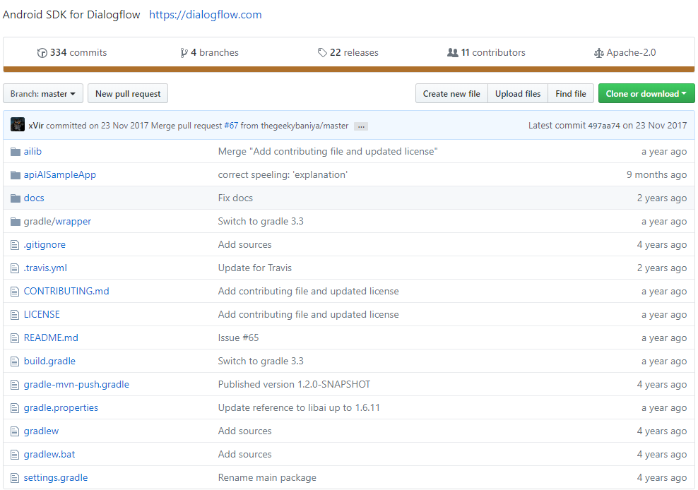
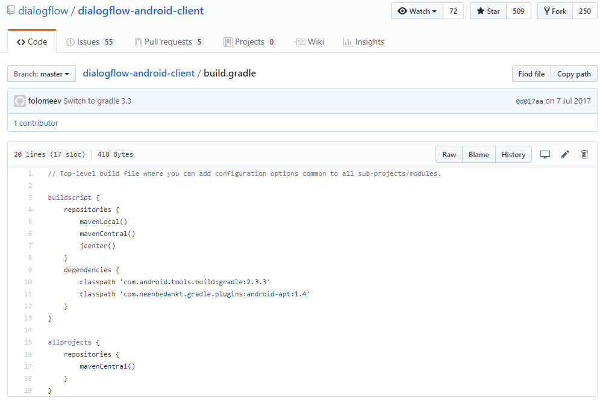
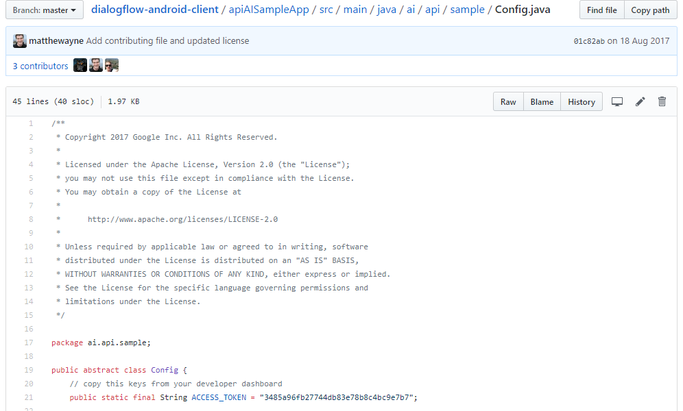
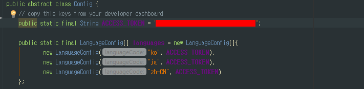
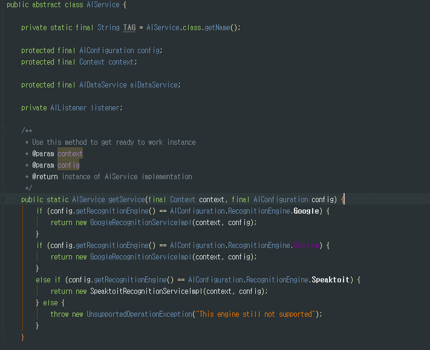
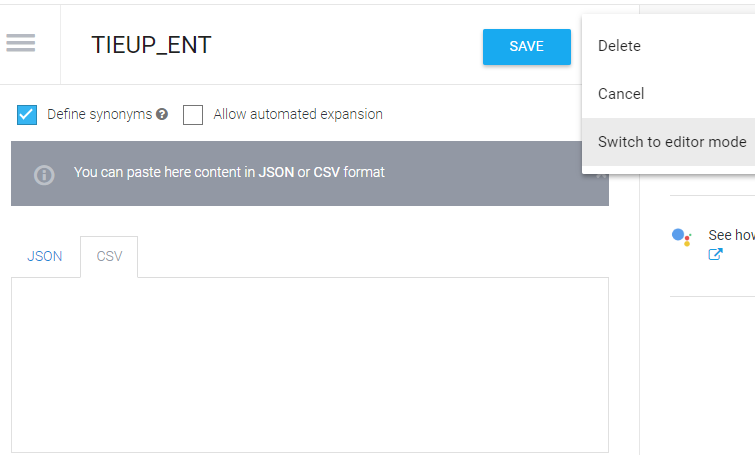

소개

모바일 개발 내에서 Voice를 이용한 검색을 하기 위해 Dialogflow를 분석중입니다. 
현재 테스트는 SQLite를 연동해서 Dialogflow에서 추출된 데이터를 검색하고 있습니다. 
단순히 Entity 등록 및 Intent만 조작하기때문에, 부족한 부분이 있을수도 있습니다. 

 

<!-- 2018-07-25 -->

## 샘플
Android SDK [Sample](https://github.com/dialogflow/dialogflow-android-client)

__Github__{: style="color: #e26716"}
   

__Base/build.gradle__{: style="color: #e26716"}
   

~~~java
dependencies {
        classpath 'com.android.tools.build:gradle:2.3.3'
}
//gradle version: 2.3.3 으로 셋팅해야 한다. 
//자신의 Android Studio Gradle Version으로 읽어 들여지기 때문에, 수정하도록한다.
~~~

__apiAiSampleApp__{: style="color: #e26716"}
   

~~~java
    public static final String ACCESS_TOKEN = "{YOUR CLIENT ACCESS TOKEN}";
~~~

### 일본 Excel 문제점
1. '?' 문구가 들어간 데이터를 찾아서 고쳐야한다. 
2. 전각 반각에 따른 데이터를 찾아서 고쳐야 한다. (ＮＴＴ、NTT)))

### 일본 Excel 에서 Dialogflow에 가공할때 문제점
AI sample source는 우선 Google Recognition을 거쳐서 text를 response 받아 text로 Dialogflow를 검색하기 때문에 
Dialogflow의 agent가 초기 설정된 kr이면 검색이 되지 않는 아주 큰 문제점이 있다.

_해결방법_
   
- Dialogflow의 agent의 언어가 kr이면, agent jp를 만들어서 작업 하는게 제일 관리 하기 편하다고 생각이 든다. 
- IMG 처럼 Config 파일에 ACCESS_TOKEN에 AGENT 각 TOKEN을 적어 넣어서 활용한다. 

   
- 또는 Dialogflow의 agent는 kr그대로 두고 sample source에서 Google Recognition에 값만 kr, jp로 변경해서 사용하는것이다. 

이방법은 검색은 되지만 TTS로 변경시 response가 한글로 오기 때문에 클라이언트에서 추가 작업을 해야 할 부분도 생긴다. 
일본어만 틀렸을때 Dialogflow를 수정시 한번에 삭제 할수가 없다. 왜냐면 중간 또는 맨 처음에 한국정보가 들어가 있기 때문이다. 

_주의할점_
- "空","空","そら","ソラ" 이 예는 Google Recognition에 어떤 음성을 인식했냐에 따라 디테일이 달라질것으로 보인다. 
- 대부분 Recognition에 JP를 설정 하면 한자로 나오기 때문에 필히 Dialogflow의 value에는 한자도 넣어두어야 한다. 

_일본장르_
- J-POP
- TV・ラジオ
- 映画・ミュージカル
- アニメ
- ポップス

### Dialogflow
~~~java
//Required 
@ ALBUM_ENT     - "앨범"        :"바람이 불었으면 좋겠어"
@ ARTIST_ENT    - "아티스트"    :"길구봉구"
@ GENRE_ENT     - "장르"        :"Ballad"
@ YEAR_ENT      - "년도"        :"2014" //2014.01.03
@ WRITER_ENT    - "작사"        :"이현승, 길구봉구"
@ COMPOSER_ENT  - "작곡"        :"이현승, 길구봉구"
@ SONG_ENT      - "타이틀-곡"   :"바람이 불었으면 좋겠어"
@ MONTH_ENT     - "월"          :"1월" //2014.01.03

//Option
@ NEGATIVE_ENT  - "OP1"         :"아닌, 하지않은, 하지않았던, 않은, 않았던"
@ IN_ENT        - "OP2"         :"속한, 참여한, 참가"

//Garbage
@ ACTION_ENT    - "빈값"        :"찾아줘, 해줘"
@ GARBAGE_ENT   - "빈값"        :"에, 중가"
@ KEYWORD_ENT   - "빈값"        :"노래"

~~~

### ENTITY 추가 할때 주의 사항
   

1."()" 괄호가 들어가면 오류가 난다. 
2."" 쌍따움표로 문자열을 감싸야 한다. 그냥 따옴표 ''는 오류남 > ''를 수정하다가 I'm같은 값을 주의해서 변경 하도록한다. 
