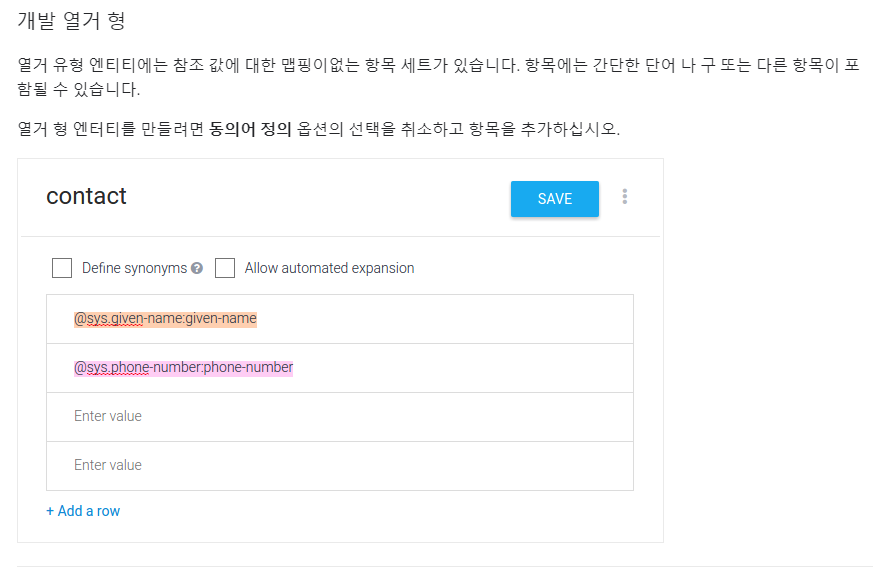

소개

모바일 개발 내에서 Voice를 이용한 검색을 하기 위해 Dialogflow를 분석중입니다. 
현재 테스트는 SQLite를 연동해서 Dialogflow에서 추출된 데이터를 검색하고 있습니다. 
단순히 Entity 등록 및 Intent만 조작하기때문에, 부족한 부분이 있을수도 있습니다. 

차후에는 Fulfillment+(Webhook)까지 테스트 해볼 생각입니다. 

<!-- 2018-07-24 -->

 

### SQLite + Dialogflow
~~~java
//Required 
@ ALBUM_ENT     - "앨범"        :"바람이 불었으면 좋겠어"
@ ARTIST_ENT    - "아티스트"    :"길구봉구"
@ GENRE_ENT     - "장르"        :"Ballad"
@ YEAR_ENT      - "년도"        :"2014" //2014.01.03
@ WRITER_ENT    - "작사"        :"이현승, 길구봉구"
@ COMPOSER_ENT  - "작곡"        :"이현승, 길구봉구"
@ SONG_ENT      - "타이틀-곡"   :"바람이 불었으면 좋겠어"
@ MONTH_ENT     - "월"          :"1월" //2014.01.03

//Option
@ NEGATIVE_ENT  - "OP1"         :"아닌, 하지않은, 하지않았던, 않은, 않았던"
@ IN_ENT        - "OP2"         :"속한, 참여한, 참가"

//Garbage
@ ACTION_ENT    - "빈값"        :"찾아줘, 해줘"
@ GARBAGE_ENT   - "빈값"        :"에, 중가"
@ KEYWORD_ENT   - "빈값"        :"노래"

~~~

### 1단계: ENTITY만으로 검색을 할때
 

#### 아티스트로 어떻게 찾을 것인가?

__검색어 A :길구봉구 노래중에 발라드 찾아줘__{: style="color: #e26716"}
~~~java
// TTS Response - Required
ARTIST_ENT      @ARTIST_ENT	    길구봉구	
GENRE_ENT       @GENRE_ENT	    발라드	
// TTS Response - Garbage
KEYWORD_ENT     @KEYWORD_ENT        노래	
GARBAGE_ENT     @GARBAGE_ENT        중에	
ACTION_ENT      @ACTION_ENT         찾아줘
---
SQLIte SELECT Query
*** Where ARTIST="@ARTIST_ENT" AND GENRE="@GENRE"
~~~

__검색어 B:길구봉구 노래중에 발라드가 아닌 것찾아줘__{: style="color: #e26716;"}
~~~java
// TTS Response - Required
ARTIST_ENT      @ARTIST_ENT         길구봉구	
GENRE_ENT       @GENRE_ENT          발라드	
NEGATIVE_ENT    @NEGATIVE_ENT       아닌	
// TTS Response - Garbage
ACTION_ENT      @ACTION_ENT         찾아줘
KEYWORD_ENT     @KEYWORD_ENT        노래	
GARBAGE_ENT     @GARBAGE_ENT        중에	
---
Java Code
if(NEGATIVE_ENT){
     //NEGATIVE_ENT가 있으면 그앞의 key를 Where not 으로 제외후 
     //검색하는 것은 어떨까 생각해봤습니다. 
     where NOT genre=@GENRE_ENT
}

SQLIte SELECT Query
*** Where NOT GENRE="@GENRE" AND ARTIST="@ARTIST_ENT"
~~~

__검색어 B: ARTIST가 아닌지, GENRE가 아닌지 어떻게 구분할것인가.__{: style="color: #FF0000;"}

#### 작사, 작곡 어떻게 찾을것인가?
__검색어 A :최신노래중에 길구봉구 작사한 노래 찾아줘__{: style="color: #e26716"}
~~~java
Query 
"최신노래중에 길구봉구 작사한 노래 찾아줘"
---
// Dialogflow training Response - Required,Garbage
KEYWORD_ENT     @KEYWORD_ENT	최신노래	
GARBAGE_ENT     @GARBAGE_ENT	중에	
ARTIST_ENT      @ARTIST_ENT     길구봉구	
WRITER_ENT      @WRITER_ENT	작사	
number          @sys.number	한	
KEYWORD_ENT1    @KEYWORD_ENT	노래	
ACTION_ENT      @ACTION_ENT	찾아줘
---
Java Code
if(WRITE_ENT)
     where write=@ARTIST_ENT

SQLIte SELECT Query
//*** Where ARTIST="@ARTIST_ENT" AND GENRE="@GENRE"
~~~

__검색어 B:최신노래중에 길구봉구가 작사하지 않은 노래 찿아줘__{: style="color: #e26716;"}
~~~java
Query 
"최신노래중에 길구봉구가 작사하지 않은 노래 찿아줘"
---
// Dialogflow training Response - Required,Garbage
KEYWORD_ENT     @KEYWORD_ENT	최신노래	
GARBAGE_ENT     @GARBAGE_ENT	중에	
ARTIST_ENT      @ARTIST_ENT     길구봉구	
ARTIST_ENT1     @ARTIST_ENT     가	
WRITER_ENT      @WRITER_ENT     작사	
ARTIST_ENT2     @ARTIST_ENT     하	
NEGATIVE_ENT    @NEGATIVE_ENT   않은	
KEYWORD_ENT1    @KEYWORD_ENT	노래	
ACTION_ENT      @ACTION_ENT     찾아줘
---
SQLIte SELECT Query
//*** Where ARTIST="@ARTIST_ENT" AND GENRE="@GENRE" ????

//Android Sample client - Response
I: Parameters: {GARBAGE_ENT="중에", KEYWORD_ENT1="노래", NEGATIVE_ENT="부정", WRITER_ENT="작사", KEYWORD_ENT="최신곡", ARTIST_ENT="길구봉구"}
I: Index[: 0] GARBAGE_ENT: "중에"
I: Index[: 1] KEYWORD_ENT1: "노래"
I: Index[: 2] NEGATIVE_ENT: "부정"
I: Index[: 3] WRITER_ENT: "작사"
I: Index[: 4] KEYWORD_ENT: "최신곡"
I: Index[: 5] ARTIST_ENT: "길구봉구"
~~~
Android Sample Client에서 검색해서 나온 Response와 Dialogflow Trainring Response와의 Parameter순서가 다릅니다.
Webhook을 써서 Response를 커스텀 한다면 입맛에 맞는 데이터를 받을수 있을수 있겠지만, 
현재는 일반적인 기능으로 데이터를 받고 있기때문에, 아래와 같은 생각으로 접근했습니다. 
원래는 "길구봉구가 작사"한 노래를 찾기 위함으로 작사 KEY:WRITER를 추가하고  작사key앞에 Artist가 있으면 
"if(WRITE_ENT) Where WRITE=@ARTIST_ENT"를 넣으려고 했지만 순서가 맞지 않아 실패했습니다.

 

### ENTITY GROUPING  

#### 아티스트 작곡/ 아티스트 작사 그룹핑으로 묶어서 한번에 받을수 없을까?

   

먼저 작사, 작곡 특정 단어에 대한 키를 만듭니다. 

   

그룹 엔티티를 만듭니다. 이때 동의어체크는 풀어두어야 합니다. 

   

위와 같이, 아티스트:작사 또는 아티스트:작곡 으로 만들면 됩니다. 그외는 응용해서 할수 있을것 같네요~

   

1. 그룹 엔티티를 만들고 나서 인텐트로 돌아와 트레이닝을 한번 시켜줍니다. 
2. 엔티티를 만들고 나서 인텐트에 적용 되는 시간이 3~5분 정도 소요되기 때문에 어느 정도 대기를 하고 트레이닝을 시켜줍니다. 
3. 처음 트레이닝을 하면 이전에 잡혀있던 엔티티가 잡혀서 그룹핑엔티티가 보이지 않습니다. 
이럴경우에는 "길구봉구"-아티스트 엔티티를 삭제합니다.
4. "작사"-WRITE_KEY_NAME_ENT값의 범위를 "길구봉구가 작사"문자열 만큼 늘려줍니다. 
5. 엔티티를 WRITE_GROUP_ENT로 변경해주고 SAVE를 하면 트레이닝이 완료 됩니다. 

[엔티티 그룹 참조 가이드](https://dialogflow.com/docs/entities#dev_enum)

~~~java
{
  "responseId": "-RANKEY-",
  "queryResult": {
    "queryText": "최신노래중에 길구봉구가 작사하지 않은 노래 찿아줘",
    "parameters": {
      "number": "",
      "WRITER_GROUP_ENT": {
        "WRITER_KEY_NAME_ENT": "작사",
        "ARTIST_ENT": "길구봉구"
      },
      "ARTIST_ENT1": "",
      "YEAR_ENT": "",
      "SONG_ENT": "",
      "ARTIST_ENT2": "이하이",
      "ARTIST_ENT": "",
      "MONTH_ENT": "",
      "ALBUM_ENT": "",
      "SING_CONTRACT1": "",
      "ACTION_ENT": "",
      "GARBAGE_ENT": [
        "중에"
      ],
      "NEGATIVE_ENT": "부정",
      "COMPOSER_GROUP_ENT": "",
      "KEYWORD_ENT": "최신곡",
      "SING_CONTRACT": "",
      "KEYWORD_ENT1": "노래",
      "GENRE_ENT": ""
    },
    "allRequiredParamsPresent": true,
    "fulfillmentText": "노래 찾았습니다.",
    "fulfillmentMessages": [
      {
        "text": {
          "text": [
            "노래 찾았습니다."
          ]
        }
      }
    ],
    "intent": {
      "name": "-RANKEY-",
      "displayName": "노래검색"
    },
    "intentDetectionConfidence": 1,
    "languageCode": "ko"
  }
}
~~~

